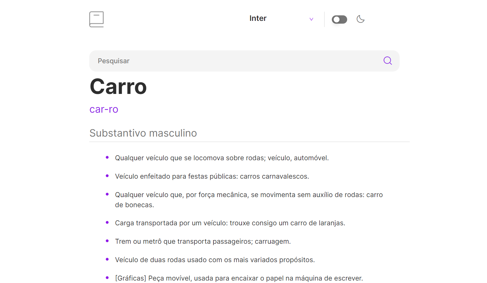
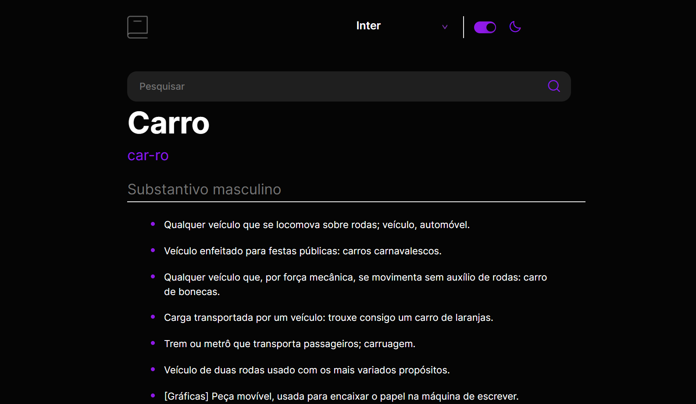

<h1 align='center'> Dictionary </h1>

## | Descrição |

Esse é o Dictionary, um app que permite o usuário encontrar o signicado das palavras pesquisadas.
Projeto desenvolvido com o intuito de colocar em prática meus conhecimentos em Vue.JS e consumo de API.

## | Techs |

## | Como rodar |

Para clonar e rodar esse projeto você precisa ter instalado: [Git](https://git-scm.com/) e [NodeJS](https://nodejs.org/en/) 

No terminal:

#### Clonando o repositório
$ `git clone https://github.com/Larissalaviniaba/-Dictionary`

#### Entrando no repositório
$ `cd dictionary`

#### Instalando dependências
$ `npm install`

#### Executando
$ `npm run dev`

#### Abra http://localhost:8080/ em seu navegador 